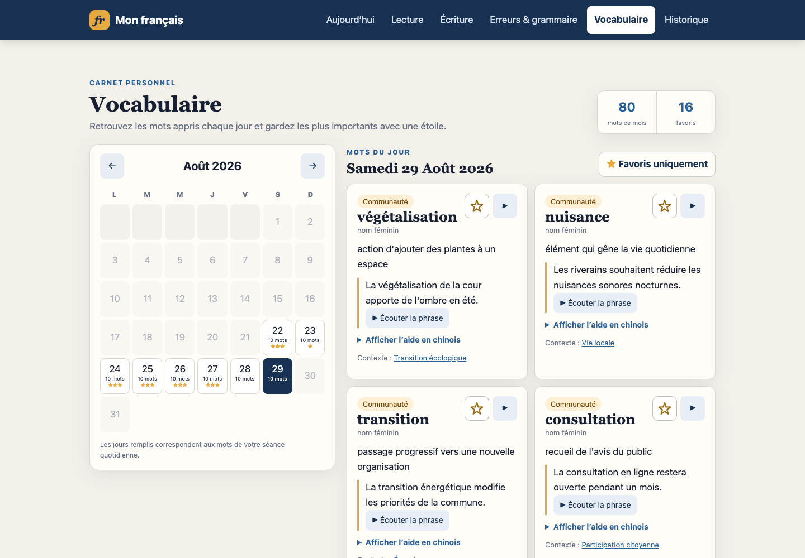
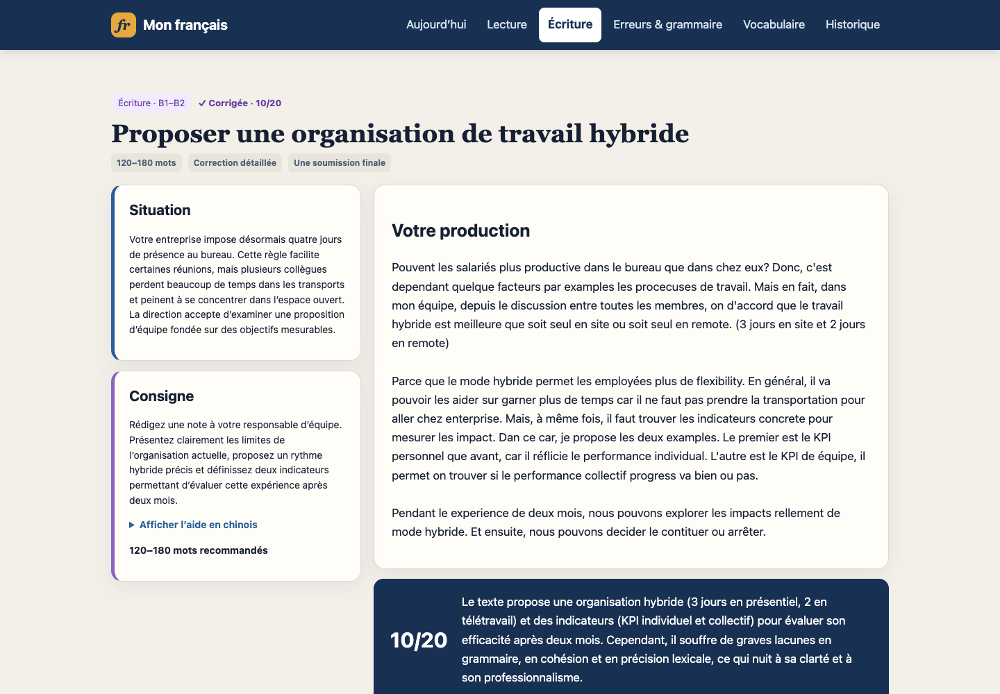
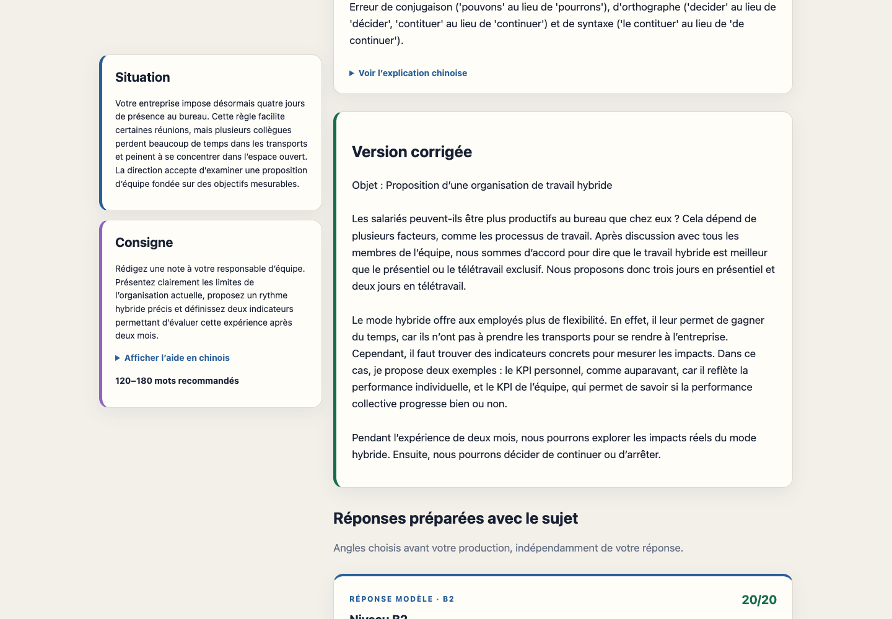
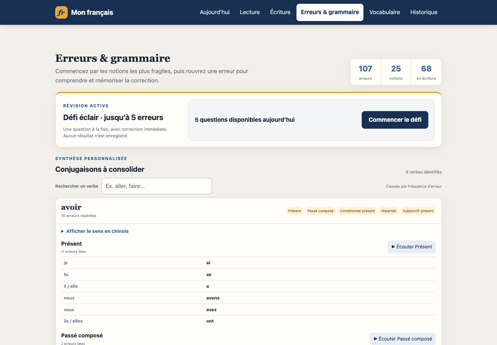

# Mon français Coach — A private AI French coach for Chinese-speaking learners

Mon français Coach is a local-first web application designed first for native Chinese speakers who want structured daily French practice from CEFR B1 to C1. Exercises stay in French, while optional Chinese explanations, vocabulary support, and writing guidance help learners understand difficult points without replacing French immersion.

The application works fully offline with its reviewed content banks. Learners who want fresh AI-generated material and detailed writing feedback can connect their own Mistral API key. The key stays outside the repository and learning database, and the server only accepts loopback connections.

**[▶ Open the interactive Live Demo](https://richradsy.github.io/mon-francais-coach/)**

The hosted demo uses sample data and browser-only simulation. It never asks for an API key, stores no learning account, and does not run the Python, SQLite, scheduling, or Mistral backend. Clone the repository for the complete private local application.

## Highlights

- 10 daily grammar exercises: 5 multiple-choice questions and 5 fill-in-the-blank questions;
- French-only prompts, with French and optional Chinese explanations after answering;
- Chinese is the default support language, with help collapsed until the learner asks for it;
- 10 contextual vocabulary items per day, calendar browsing, persistent favourites, and filtering;
- a source-linked B2 reading task with a server-enforced eight-minute deadline;
- a B1–B2 writing task with strict scoring out of 20, corrections, error review, personalised guidance, and B2/C2 model answers;
- SQLite-backed history, mistake tracking, grammar statistics, and durable in-progress work;
- offline-first generation with optional Mistral enrichment and strict local validation;
- local French pronunciation through the macOS `Thomas (fr-FR)` voice;
- no Python package dependencies and no cloud account for learning data.

## Quick start

Requirements: Python 3.11+, macOS for native speech and Keychain integration, and `curl` for optional Mistral requests.

```bash
git clone https://github.com/RichradsY/mon-francais-coach.git
cd mon-francais-coach
python3 -m french_learning serve --offline
```

Open http://127.0.0.1:8765. The offline mode requires no API key.

## Preview

Explore all six sections in the **[Live Demo](https://richradsy.github.io/mon-francais-coach/)**, or preview selected screens below.

| Vocabulary calendar | Writing feedback |
|---|---|
|  |  |

| Targeted writing correction | Mistake and grammar review |
|---|---|
|  |  |

## Use your own Mistral API key

The recommended setup opens a hidden macOS Keychain password prompt. The key is not written to the repository, SQLite database, logs, or process arguments:

```bash
python3 -m french_learning configure-api
python3 -m french_learning serve
```

For temporary or non-Keychain environments, the application also reads `MISTRAL_API_KEY`. Enter it without placing the value in shell history:

```bash
read -s MISTRAL_API_KEY
export MISTRAL_API_KEY
python3 -m french_learning serve
unset MISTRAL_API_KEY
```

Do not add real credentials to source files. `.env` and `.env.*` are ignored as an additional safeguard, but this project deliberately does not auto-load dotenv files.

## Privacy and security model

- The HTTP server refuses non-loopback addresses.
- Runtime databases, backups, logs, editor files, and environment files are ignored by Git.
- API keys are validated and passed to `curl` through a private temporary configuration file rather than command-line arguments.
- Learning records remain local. Public RSS titles and pedagogical prompts are sent to Mistral during online lesson generation; learner writing is sent only after an explicit correction request.
- Generated lessons and writing feedback pass local structural and pedagogical validation, with controlled offline fallback.

## Development

```bash
python3 -m unittest discover -s tests -v
```

The code uses only the Python standard library. See `docs/SYSTEM_DESIGN.md` and `docs/REQUIREMENTS_TRACEABILITY.md` for architecture and requirement coverage.

## Roadmap: support-language selection

The current release is intentionally Chinese-first. The next planned product step is a support-language selector: Chinese remains the default, while learners can choose another explanation language without changing the French exercises, scoring rules, or immersion-first interface.

## Make it yours with your own AI agent

This repository is intentionally straightforward to modify with a coding agent. After cloning it, you can ask your preferred agent to adapt the learning experience to your goals—for example:

- change the CEFR range or create a gradual A2 → B1 → B2 progression;
- adjust the number, duration, balance, or difficulty of daily exercises;
- focus on TCF/DELF preparation, workplace French, pronunciation, grammar, or writing;
- change when Chinese help appears or replace it with another support language;
- add exercise types, scoring dimensions, learning statistics, or a different compatible AI provider;
- personalise prompts and review rules while retaining offline fallback and local validation.

Example request for a coding agent:

> Adapt this project for an A2 learner progressing toward B1. Keep the server loopback-only, preserve offline fallback and secure API-key handling, reduce the daily session to six exercises, add a gradual weekly difficulty curve, update validators and documentation, and run the relevant tests before finishing. Never read or commit local databases, logs, `.env` files, or credentials.

Useful starting points are `french_learning/content.py` for controlled exercises, `french_learning/tasks.py` for reading and writing tasks, `french_learning/mistral_provider.py` for AI prompts and validation, and `tests/` for the behavioural contract. Ask the agent to preserve privacy safeguards, update tests together with behaviour, and show a final diff before committing. Never paste an API key into an agent prompt or source file.

## Project structure

```text
french_learning/   application, content generation, API, SQLite, and static UI
tests/             unit, HTTP integration, and frontend contract tests
docs/              system design and requirements traceability
data/              local runtime database (ignored by Git)
logs/              local runtime logs (ignored by Git)
```

## Documentation en français

Application locale de pratique quotidienne du français avec correction, historique, erreurs, grammaire, vocabulaire contextualisé et prononciation.

## Personnaliser avec votre propre agent IA

Après avoir cloné le dépôt, vous pouvez demander à votre agent de développement d'adapter le niveau CECRL, la progression, le nombre et la durée des exercices, les types d'activités, la langue d'aide, le barème ou le fournisseur IA. Demandez-lui de conserver l'écoute locale, le repli hors ligne, la validation pédagogique et la gestion sécurisée des clés, puis de mettre à jour les tests avec chaque changement. Ne transmettez jamais votre clé API dans un prompt.

## Fonctionnalités

- 5 questions à choix multiple + 5 textes à compléter par jour ;
- questions et options uniquement en français ;
- correction avec explications en français et en chinois pour tous les choix ;
- 5 mots issus de contextes communautaires + 5 mots du quotidien ;
- page Vocabulaire indépendante avec calendrier mensuel, suivi des mots par jour, favoris persistants et filtre par étoile ;
- une lecture B2 quotidienne adaptée d'une source RSS vérifiable, masquée avant confirmation, puis limitée à 8 minutes avec reprise du compte à rebours, remise anticipée et envoi automatique à échéance ;
- un sujet d'écriture B1–B2 avec compteur de mots, correction Mistral détaillée, barème strict sur 20 (quatre dimensions sur 5), erreurs réinjectées dans la révision, version corrigée, deux réponses modèles B2/C2 préparées avec le sujet, deux autres sur le thème choisi par l'apprenant, aide lexicale chinoise et conseils d'optimisation ;
- historique typé distinguant les 10 questions, la lecture et l'écriture ;
- historique SQLite, erreurs et statistiques par point de grammaire ;
- lecture locale hors ligne avec la voix macOS `Thomas (fr-FR)` : mots et exemples à la demande, phrases des exercices uniquement après publication de la correction ;
- préparation automatique quotidienne à 07:00 ;
- génération Mistral optionnelle avec double contrôle, sources communautaires récentes et repli hors ligne ;
- aucune dépendance Python externe ; les données RSS et prompts pédagogiques sont envoyés à Mistral lors de la préparation, et le texte de l'apprenant uniquement lorsqu'il demande explicitement une correction d'écriture.

## Génération Mistral sécurisée

La clé n'est jamais stockée dans le projet, la base, les logs ou les LaunchAgents. Pour enregistrer sa propre clé dans le trousseau macOS avec une saisie masquée :

```bash
python3 -m french_learning configure-api
```

La variable temporaire `MISTRAL_API_KEY` est également prise en charge. Les fichiers `.env` restent ignorés et ne sont pas chargés automatiquement.

Le système utilise `mistral-medium-latest` pour générer les textes à compléter, le vocabulaire récent, une synthèse de lecture B2 et un sujet d'écriture, puis effectue une seconde passe de contrôle pédagogique. Les QCM quotidiens proviennent toujours de la banque humaine contrôlée. La lecture conserve une URL issue du RSS, est présentée comme une synthèse pédagogique adaptée et possède exactement quatre questions validées localement. En cas d'échec réseau ou de validation, toute la journée utilise les banques contrôlées hors ligne.

Une journée est générée une seule fois puis mise en cache. La préparation quotidienne réserve deux créneaux même si elle échoue. Chaque production écrite permet une seule correction finale et réserve un créneau avant l'appel ; un échec reste comptabilisé mais remet la tâche à l'état prêt afin de permettre une relance consciente. Le plafond commun est de 105 requêtes par mois : jusqu'à 62 pour 31 préparations quotidiennes, 31 corrections d'écriture et 12 créneaux de marge. Les tarifs Mistral peuvent évoluer ; le coût réel reste donc contrôlé par ce plafond dur et l'historique local d'usage, pas par une estimation figée.

La lecture suit un état serveur `ready → in_progress → completed`. Avant le démarrage, l'API ne transmet ni article ni questions. Après confirmation, le serveur fixe une échéance immuable de 8 minutes ; le navigateur affiche le temps restant à partir de cette échéance, conserve localement les choix en cas de rafraîchissement et envoie les réponses à 00:00. Une remise manuelle partielle est permise ; toute question vide est incorrecte. Si le navigateur est fermé, le serveur clôt l'exercice à la prochaine consultation, sans prolonger le temps.

## Démarrage immédiat

Prérequis : Python 3.11 ou plus récent.

```bash
cd mon-francais-coach
python3 -m french_learning serve
```

Ouvrir ensuite : http://127.0.0.1:8765

Arrêt : `Ctrl+C`.

## Démarrage automatique sur macOS

La commande suivante installe deux LaunchAgents utilisateur : le serveur local et la préparation quotidienne à 07:00.

```bash
cd mon-francais-coach
python3 -m french_learning install-scheduler
```

Fichiers installés :

- `~/Library/LaunchAgents/com.local.french-learning.server.plist`
- `~/Library/LaunchAgents/com.local.french-learning.daily.plist`

Vérification :

```bash
launchctl print gui/$(id -u)/com.local.french-learning.server
launchctl print gui/$(id -u)/com.local.french-learning.daily
curl http://127.0.0.1:8765/api/health
```

Désinstallation manuelle :

```bash
launchctl bootout gui/$(id -u) ~/Library/LaunchAgents/com.local.french-learning.server.plist
launchctl bootout gui/$(id -u) ~/Library/LaunchAgents/com.local.french-learning.daily.plist
rm ~/Library/LaunchAgents/com.local.french-learning.{server,daily}.plist
```

## Commandes utiles

Préparer la séance sans démarrer le serveur (opération idempotente) :

```bash
python3 -m french_learning generate-today
```

Forcer le mode hors ligne :

```bash
python3 -m french_learning generate-today --offline
python3 -m french_learning serve --offline
```

Exécuter tous les tests :

```bash
python3 -m unittest discover -s tests -v
```

Utiliser une autre base ou un autre port :

```bash
python3 -m french_learning serve --db /chemin/apprentissage.db --port 9000
```

Le serveur refuse volontairement les adresses non locales.

## Données, sauvegarde et restauration

La base réelle est `data/learning.db` (ignorée par Git).

Sauvegarde à froid : arrêter l'application, puis copier `data/learning.db`. Pour restaurer, arrêter l'application et remettre la copie au même emplacement. SQLite utilise WAL pendant l'exécution ; évitez de copier le seul fichier `.db` pendant que le serveur écrit.

## Structure

```text
french_learning/
  content.py       contenu B1 contrôlé et sélection déterministe
  repository.py    schéma et requêtes SQLite
  service.py       génération, redaction et correction
  mistral_provider.py génération IA, RSS, audit et validation stricte
  web.py           API HTTP locale et fichiers statiques
  scheduler.py     planification interne et LaunchAgents
  static/          interface HTML/CSS/JavaScript
tests/             tests unitaires et d'intégration HTTP
docs/              conception et traçabilité des exigences
data/               base locale, non versionnée
```

## Sources communautaires

Le générateur en ligne lit les titres RSS publics récents de `r/france` et, en repli, de France Info. Ces titres sont traités comme données non fiables, jamais comme instructions. Chaque mot communautaire conserve le nom et l'URL de sa source. Si Mistral est indisponible, la banque éditoriale locale fournit des mots traçables.

## Git

Voir les versions :

```bash
git log --oneline --decorate
```

Voir les changements locaux :

```bash
git status --short
git diff
```
